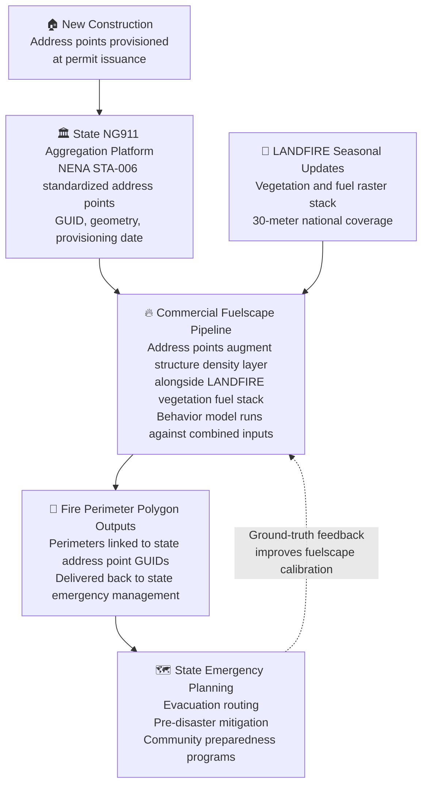

# 🔥 WUI NG911 Fuelscape Exchange

A conceptual framework proposing a reciprocal data exchange between state NG911 aggregation programs and commercial wildfire risk modeling platforms to address the structure-density gap in current fire behavior models. This repository documents original thinking developed independently on June 25, 2026, and is shared freely for public benefit. No proprietary data, employer resources, or third-party confidential information was used in developing this concept.

---

## 📋 Overview

Current wildfire risk models are built on vegetation-based fuel datasets, primarily LANDFIRE, that classify surface and canopy fuel characteristics at 30-meter resolution across the United States. These models have demonstrated strong performance in predicting wildland fire behavior across undeveloped terrain.

The January 2025 Los Angeles Palisades and Eaton fires exposed a structural gap in this framework. Both fires transitioned from vegetation-fueled wildland fires into wildfire-induced conflagrations, events where the primary fuel source shifts from native vegetation to the built environment, with fire spreading structure-to-structure independent of the vegetative fuel bed between them. LANDFIRE contains no fuel model for this transition. The Scott and Burgan FBFM40 classification system, which underpins nearly all current fire behavior modeling, has no category for wood-frame residential structures, synthetic building materials, or inter-structure spacing.

This gap has two compounding dimensions.

First, structures are fuel. A wood-frame house with asphalt shingles, synthetic insulation, and stored combustibles represents a concentrated fuel load that can exceed the heat release rate of the native vegetation it replaced. When fire enters a subdivision, the fuel model changes fundamentally and current behavior models do not account for that transition.

Second, the fuel load grows every year. WUI development continues to push housing into fire-prone landscapes at a pace that static or annually updated datasets cannot track. A risk model calibrated on 2022 structure density systematically understates risk in 2026 in any jurisdiction where new construction has occurred.

Existing retrospective datasets, including Microsoft and Google building footprints, NAIP imagery, and assessor parcel data, capture what was built, not what is being built. This concept proposes a data source that sits closer to the leading edge of new construction: NG911 address point data provisioned at permit issuance, aggregated at the state level, and standardized under the NENA STA-006 GIS Data Model.

---

## 🏗️ The Core Insight: NG911 Address Points as a Forward-Looking Structure Dataset

Next Generation 911 requires that every occupiable structure have a provisioned address point in the local PSAP's GIS database before that structure can receive emergency service routing. The regulatory urgency of that requirement, an unroutable address is a life-safety failure, means jurisdictions push new address points into the system as early as permit issuance, months before physical construction is complete and years before any satellite-derived building footprint dataset would detect the structure.

This temporal advantage is the key property that distinguishes NG911 address data from all other structure inventory sources currently available.

Under the NENA STA-006 GIS Data Model standard, every address point is assigned a Globally Unique Identifier (NGUID) that persists across jurisdictional boundaries and system updates. This standardization is the technical property that makes aggregation tractable.

State 911 programs aggregate local PSAP data into statewide validated datasets. Arizona, Texas, California, and others operate statewide NG911 GIS aggregation and provisioning platforms. Rather than negotiating data access with hundreds of individual PSAPs, a single state-level data sharing agreement provides access to the full standardized, GUID-stamped address point inventory for that state, updated continuously as new structures enter the provisioning pipeline.

---

## 🔄 The Proposed Exchange Architecture

The secondary use of NG911 data for commercial purposes raises legitimate policy concerns. Address points were collected for emergency routing, not for commercial risk scoring, and that distinction matters institutionally and legally.

This concept addresses that concern through a reciprocal public safety data exchange rather than a commercial data licensing arrangement. The structure is as follows.

The state contributes its aggregated, NENA-standardized address point dataset to the exchange. This provides a continuously updated structure inventory with GUID linkage, capturing new construction as early as permit issuance.

The commercial modeling partner contributes calibrated fire behavior analysis capability. Using the state address point data to augment fuelscape calibration and behavior model inputs, the partner runs fire perimeter simulations tied to actual occupied structure locations rather than a national dataset with a seasonal or annual update lag.

The state receives fire perimeter polygon outputs tied to its own address point GUIDs, at a spatial and temporal resolution it could not produce independently, delivered back for use in community emergency planning, evacuation route modeling, and pre-disaster mitigation programs.

The commercial partner receives the most current structure inventory available for that state, improving the accuracy of its risk surface in ways that benefit both the commercial product and the public safety mission.

Neither party receives the other's proprietary analytical outputs. The state does not receive the actuarially calibrated, property-level risk scores that feed insurance underwriting. The commercial partner does not receive the raw 911 operational data beyond the address point geometry and GUID. Both relationships stay within their appropriate policy lanes.

---

## 📊 Data Flow

---

## 🔁 Why This Is a Continuously Improving Loop

The exchange does not produce a one-time dataset. It creates a feedback cycle where both parties improve over time across three compounding dimensions.

As the state provisions new address points, the commercial fuelscape updates to reflect current structure density. As behavior model outputs reveal terrain conditions or fuel classification discrepancies that local fire managers can ground-truth, that feedback improves fuelscape calibration for the next cycle. As climate conditions change and seasonal fuel updates arrive from LANDFIRE, the behavior model reruns against the current combined dataset and delivers updated perimeters back to the state.

As NENA STA-006 expands to include fuel-relevant built-environment attributes, a third dimension enters the loop. Address points provisioned under the expanded standard carry construction type, roof classification, and occupancy data joined from permit records at the moment of issuance. Those attributes improve fuelscape calibration not just by locating structures but by characterizing them as fuel sources. More accurate fuel characterization produces more accurate fire perimeters. More accurate perimeters improve emergency planning outcomes. Better outcomes create institutional pressure to maintain and improve attribute data quality. The dataset grows smarter at the geometry, density, and fuel characteristic levels simultaneously, compounding in value with every provisioning cycle.

This mirrors the existing LANDFIRE data contribution model, where local land managers submit disturbance polygons and treatment records that inform national dataset updates, receiving improved national data in return. The NG911 exchange extends that logic into the structure inventory dimension that LANDFIRE currently cannot address, and the attribute expansion extends it further into the built-environment fuel characterization dimension that no current national dataset addresses at all.

---

## 🌍 International Extension: The Template Is Portable

The structural gap this concept addresses is not unique to the United States. Every fire-exposed nation faces the same combination of slowly updating national vegetation fuel datasets, structure inventories that lag real construction activity, and emergency addressing infrastructure that captures new structures faster than any satellite-derived dataset. The specific systems differ by country but the exchange architecture transfers directly.

Canada operates the National Address Register under Statistics Canada, a nationally standardized address point program with coverage and update cadence comparable to NG911 provisioning. The Canadian Wildland Fire Information System provides the fire behavior modeling infrastructure the exchange would feed. Australia maintains the Geocoded National Address File, known as GNAF, as a nationally standardized address dataset governed federally and updated continuously by state and territory contributors. The Australasian Fire and Emergency Service Authorities Council coordinates fire behavior data and emergency planning across jurisdictions. The European Union's INSPIRE Directive mandates standardized address point spatial data infrastructure across all member states, creating a single governance framework for address data exchange across dozens of fire-exposed countries simultaneously.

In each case the proposal is the same: current address points in, calibrated fire perimeter outputs back, embedded into national or regional emergency planning infrastructure through a reciprocal public safety data exchange. The institutional partners change. The architecture does not.

Precisely already operates in over 100 countries with enterprise relationships spanning insurers, utilities, and government agencies in fire-exposed regions across all of these markets. The international extension of this exchange is not a cold outreach problem. It is an existing relationship extended into a new data arrangement that benefits both parties. Each national implementation improves the underlying fire behavior model by introducing new fire regimes, Mediterranean shrublands, Australian eucalyptus forests, Canadian boreal timber, that train a more robust and generalizable global risk surface. The more geographies participating in the exchange, the better the model performs everywhere.

At full international scale this concept describes a globally embedded fire risk data infrastructure anchored to public safety missions that government partners are institutionally motivated to maintain, generating commercial risk surface improvements that no competitor could replicate without replicating a decade of relationship building across dozens of sovereign jurisdictions. The competitive moat is not the data. It is the network of trust that the exchange requires and rewards.

---

## ⚠️ Known Limitations and Open Questions

**Secondary use policy.** The most significant barrier to implementation is the policy question of whether NG911 data collected for emergency routing can be used, even in a public safety context, for purposes beyond direct call routing. State 911 program directors and legal counsel would need to evaluate this question. The public safety framing of the exchange is the strongest argument for permissibility, but it does not resolve the question automatically.

**State aggregation maturity varies.** NG911 GIS aggregation programs are operational in a growing number of states but implementation is uneven, particularly in rural states and jurisdictions with limited 911 authority resources. The states where WUI fire risk is most acute, California, Texas, Oregon, Colorado, and Washington, are also among the states with more mature statewide NG911 programs, which partially mitigates this concern.

**Address points capture location, not building characteristics.** NG911 address data establishes where a structure is and when it entered the provisioning pipeline. It does not currently carry construction type, building materials, roof classification, or square footage. Those attributes would need to be joined from assessor parcel records or building permit databases to fully characterize the structure as a fuel source. The NG911 layer provides the temporal leading edge and the attribute enrichment requires additional data sources under the current standard.

However, this gap is addressable through standards expansion rather than a new data collection effort. Building permit records, which exist in the same administrative moment as address point provisioning, already capture construction type, roof classification, square footage, and occupancy type for fire code compliance purposes. A local GIS specialist populating an NG911 address point at permit issuance has access to those attributes in the same workflow. If NENA expanded STA-006 to require a small set of fuel-relevant built-environment fields, those attributes would flow through the existing state aggregation pipeline automatically, at no additional collection cost, carried on the same GUID that links the address point to every downstream system.

This creates a fully closed loop. More complete address point attributes produce more accurate fuelscape calibration. More accurate fuelscape calibration produces more accurate fire perimeter outputs. More accurate fire perimeters improve state and local emergency planning. Better planning outcomes create institutional pressure to maintain attribute data quality. The accuracy of the input determines the usefulness of the output at every stage, which is the foundational principle of all spatial analysis work worth building.

The standards development path would involve NENA's Data Structures Committee, potentially in coordination with USFA, USFS fire modeling programs, and state emergency management agencies. It is a policy and coordination challenge, not a technical one. The data already exists at the point of collection. The standard does not yet require capturing it.

The timing of this proposal matters. NG911 data standards are still maturing and national aggregation infrastructure is still forming. NERIS is in active development and the FCC's 2024 and 2025 orders are still working through state and local implementation cycles. NENA STA-006 is under active revision. This is the window where expanding attribute capture requirements is practical and low-cost, before the standard ossifies and before national pipeline architecture hardens around a schema that excludes fuel-relevant fields.

Retroactive attribution of existing address points would be expensive, manually intensive, and produce inconsistent results across jurisdictions. Prospective capture costs nothing beyond a standard update. Every address point provisioned after the standard expands carries the attributes automatically. The dataset does not need to be complete to be useful. It grows into completeness organically as new construction occurs and existing records are touched during routine maintenance. By the time national aggregation through NERIS or a successor platform reaches operational maturity, a fuel-attributed address point dataset provisioned under the expanded standard would represent one of the most current, most granular, and most actionable structure inventories available anywhere for fire behavior modeling and emergency planning. Starting now is what makes that future dataset possible.

**NERIS as a future federal aggregation point.** The U.S. Fire Administration's National Emergency Response Information System is a developing national platform designed to aggregate standardized emergency response data across jurisdictions. As NERIS matures, it may provide a federal-level access point for NG911-adjacent data that reduces the state-by-state relationship management burden. This concept is designed to be compatible with that future architecture.

**The building attributes gap and the FBFM40 framework.** Even with structure location, density, and basic construction attributes incorporated, fire behavior models would need to evolve to consume built-environment fuel parameters natively. The FBFM40 classification system has no current mechanism for structure-as-fuel modeling. Extending the fuel model framework to incorporate built-environment fuel characteristics is a parallel research problem that this data exchange supports but does not solve on its own.

---

## 🔗 Relationship to Existing Data Exchange Models

This concept extends patterns already established in the federal geospatial data ecosystem.

LANDFIRE operates on contributed disturbance and treatment data from federal, state, local, and private land managers, delivering improved national datasets in return. The USGS 3DEP program aggregates elevation data contributed by federal and state partners into a nationally consistent product available to all users. FEMA's National Flood Hazard Layer incorporates locally produced flood studies into a national regulatory framework.

The NG911-fuelscape exchange follows the same logic: locally maintained operational data, standardized under a national framework, contributed to a shared analytical pipeline, with improved analytical outputs returned to the contributing jurisdiction.

---

## 📚 References

NENA Standard for NG9-1-1 GIS Data Model, NENA-STA-006.2-2022

FCC Report and Order, Facilitating Implementation of Next Generation 911 Services, September 2024

LANDFIRE Program Overview, USDA Forest Service and DOI, landfire.gov

Scott and Burgan Fire Behavior Fuel Models, USDA Forest Service General Technical Report RMRS-GTR-153, 2005

Cotality Wildfire Risk Report 2025, cotality.com

Moody's RMS, One Year After the 2025 Los Angeles Fires, February 2026

Delos Insurance Solutions, LA Wildfires Reveal Gaps in Insurance Wildfire Risk Models, February 2026

U.S. Fire Administration, National Emergency Response Information System, NERIS, usfa.fema.gov

---

## 👤 Author

Austin Addington Berlin
Founder, AECE Omnis LLC
AI-GIS Convergence Research
linkedin.com/in/austinberlin
github.com/Austin-AECEomnis

*This concept was developed independently using publicly available information. It is shared freely for public benefit and is not connected to any current or prospective employer, their resources, or proprietary information. Filing date: June 25, 2026.*
